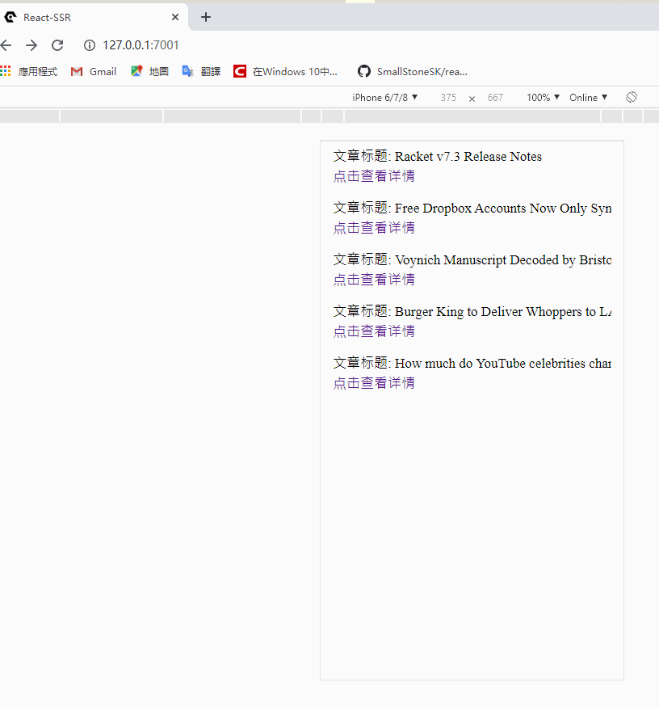
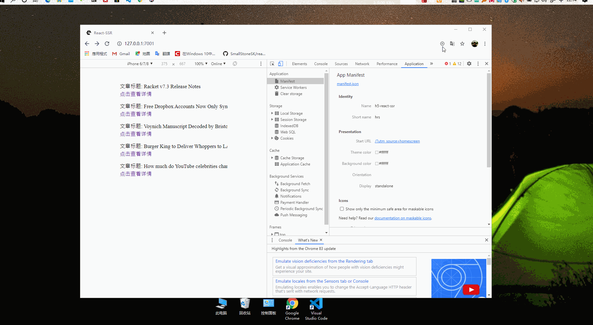

# H5-React-SSR应用骨架

## 基于小而美的[Egg-React-SSR](http://ykfe.surge.sh)框架实现了以下功能/特性
- [x] 基于[babel-plugin-import](https://github.com/ant-design/babel-plugin-import)实现了[Ant Design Mobile](https://mobile.ant.design/index-cn)按需加载
- [x] 基于[DvaJs](https://dvajs.com/)实现数据管理
- [x] 基于[react-transition-group](https://github.com/reactjs/react-transition-group)实现路由转场动画效果
- [x] 基于[postcss-px2rem-exclude](https://www.npmjs.com/package/postcss-px2rem-exclude)实现自动转换px为rem
- [x] 基于[workbox-webpack-plugin](https://developers.google.com/web/tools/workbox/modules/workbox-webpack-plugin#full_injectmanifest_config)实现PWA(渐进式网络应用程序)

# 启动
```
$ yarn
$ yarn start
$ open http://localhost:7001
```

# [部署](http://ykfe.surge.sh/guide/deploy.html#%E5%87%86%E5%A4%87)
```
$ yarn prod
```
# 配置
> 路由转场动画

<div align="center">
  
</div>

| 配置`config/config.ssr.js`

```JavaScript
//'''
 routes: [
    {
      path: '/',
      exact: true,
      Component: () => (require('@/page/index').default), // 这里使用一个function包裹为了让它延迟require
      controller: 'page',
      handler: 'index',
      sceneConfig: {          // 添加动画配置
        enter: 'from-bottom', // 入场动画 目前只写了 from-right: 右侧淡入， from-bottom：下方淡入
        exit: 'to-bottom'     // 出场动画 目前只写了 to-right: 右侧淡出，to-bottom：下方淡出
      }
    }
//'''
```
如果想自定义其他动画可以在`web/assets/common.less`按照命名规则定义

> px转rem

| 配置`build/util.js`

```JavaScript
//'''
 require('postcss-px2rem-exclude')({ 
    // 设计稿750，根据设计稿来设置
    remUnit: 75, 
    exclude: /node_modules/i 
})
//'''
```
> PWA(渐进式网络应用程序)
<div align="center">
  
</div>

| workbox配置`build/webpack.config.base.js`

```JavaScript
//'''
const { GenerateSW } = require('workbox-webpack-plugin');
//...
new GenerateSW({
    // https://webpack.docschina.org/guides/progressive-web-application/
    // 具体配置： https://developers.google.com/web/tools/workbox/modules/workbox-webpack-plugin#full_injectmanifest_config
    skipWaiting: true, // 强制等待中的 Service Worker 被激活
    clientsClaim: true, // Service Worker 被激活后使其立即获得页面控制权
})
//...
```
| 配置manifest`app/public/manifest.json`
```JSON
{
    "name": "h5-react-ssr",
    "short_name": "hrs",
    "description": "H5-React-SSR应用骨架",
    "icons": [
        {
            "src": "144x144.png",
            "type": "image/png",
            "sizes": "144x144"
        }
    ],
    "scope": "/",
    "start_url": "/?utm_source=homescreen",
    "background_color": "#ffffff",
    "theme_color": "#ffffff",
    "display": "standalone",
    "prefer_related_applications": false,
    "lang": "zh-CN"
}
```

> tdk及mate标签

| Dva system/save `web/models/system.js`
```JavaScript
yield put({
    type: 'system/save',
    payload: {
        title: data.detail,
        meats: [{
            name: 'description',
            content: '详情'
        }, {
            name: 'keywords',
            content: 'News'
        }]
    }
})
```
----
欢迎访问我的[博客](https://www.jiaiyan.com/)及关注我的个人公众号 `管子先生`
<div align="left">
  
</div>